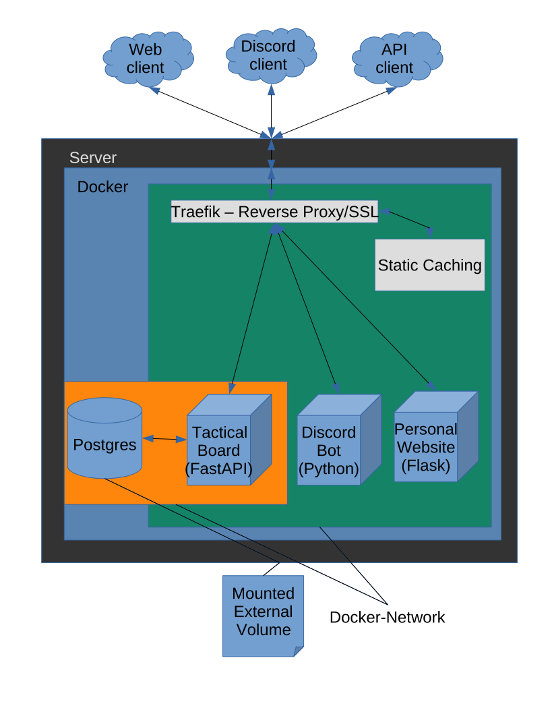

# DockerDeployment

The following is a setup of a Linode server to use with docker.
Clients hit server, server passes traffic to reverse proxy and passes request to proper container


# Setup Linode Ubuntu Server with Linode-CLI and set up SSH
```
    # Get the linode-cli
    > mkdir linode-cli
    > python3 -m pip install virtualenvironment
    > python3 -m virtualenv venv
    > source venv/bin/active
    > python -m pip install linode-cli --upgrade
    > linode-cli configure
    > linode-cli ssh root@<Server_Name>
    > apt update && apt upgrade
    > hostnamectl set-hostname personal-server
    > nano /etc/hosts # add server-ip and hostname under localhost
    > adduser admin
    > adduser admin sudo
    > exit
    > linode-cli ssh admin@<Server_Name>
    > mkdir .ssh

    Open a new local terminal and create an ssh key on local machine:
    > ssh-keygen
    > linode-cli linodes list # get servers ip
    > scp ~/.ssh/<filename>.pub admin@<ip-address>:~/.ssh/authorized_keys

    On server terminal:
    > sudo chmod 700 ~/.ssh/
    > sudo chmod 600 ~/.ssh/*
    > sudo nano /etc/ssh/sshd_config # Set PermitRootLogin to no and PasswordAuthentication no
    > sudo systemctl restart sshd

    # Configure Default firewall
    > sudo apt install ufw
    > sudo ufw default allow outgoing
    > sudo ufw default deny incoming
    > sudo ufw allow ssh # enable to allow ssh connections
    > sudo ufw enable

    # Add docker
    https://docs.docker.com/engine/install/ubuntu/
```

Get Docker-compose files on server or you could use Github:
```
    > scp <filename> admin@<ip-address>:~/folder/<filename>
```

Download Docker images with Github Packages:
```
    > docker pull docker.pkg.github.com/OWNER/REPOSITORY/IMAGE_NAME:TAG_NAME
```

Publish Docker images so server can download them:
```
    # Login with token
    > cat personal_token | docker login https://docker.pkg.github.com -u GITUSERNAME --password-stdin
    
    # Upload premade image:
    > docker images # will contain image id
    > docker tag IMAGE_ID docker.pkg.github.com/OWNERS_GIT/REPOSITORY/IMAGE:TAG # image and tag can be what you want
    > docker push docker.pkg.github.com/OWNERS_GIT/REPOSITORY/IMAGE:TAG

    # Build image and upload
    > docker build -t docker.pkg.github.com/OWNERS_GIT/REPOSITORY/IMAGE:TAG /path/to/dockerfile/folder
    > docker push docker.pkg.github.com/OWNERS_GIT/REPOSITORY/IMAGE:TAG
```

Process to Deploy to Linode server with Traefic reverse proxy:

Docker-compose files will hold various configurations for Traefik:

For local/testing:

For production:

